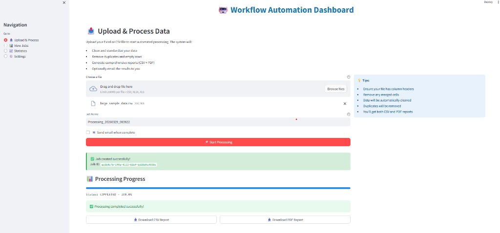
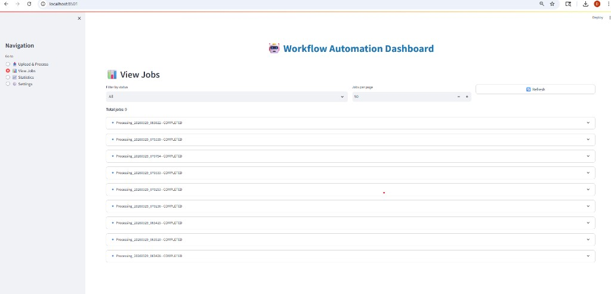

# 📸 Add Screenshots in 10 Minutes - Simple Guide

## 🎯 Goal: Make Your Repo 10x More Professional

Screenshots = More stars, more clients, more credibility!

---

## ✅ Quick 3-Step Process

### Step 1: Take 4 Screenshots (5 minutes)

**Start your app:**
```bash
# Terminal 1
python -m uvicorn backend.main:app --reload

# Terminal 2  
celery -A workers.celery_app worker --loglevel=info --pool=solo

# Terminal 3
streamlit run dashboard/app.py
```

**Take these screenshots:**

1. **Upload Screen** (`upload.png`)
   - Go to: http://localhost:8501
   - Show the upload interface
   - Use Windows Snipping Tool (Win + Shift + S)
   - Save to desktop

2. **Progress Bar** (`progress.png`)
   - Upload sample_data.csv
   - Capture the progress bar at 50-80%
   - Screenshot it

3. **Job List** (`jobs.png`)
   - Click "View Jobs" in sidebar
   - Show completed jobs with download buttons
   - Screenshot

4. **API Docs** (`api-docs.png`)
   - Go to: http://localhost:8000/docs
   - Show the interactive API documentation
   - Screenshot

---

### Step 2: Add Screenshots to Repo (3 minutes)

```bash
# Create folder
mkdir -p assets/screenshots

# Copy your 4 screenshots from Desktop to this folder
# Rename them to:
# - upload.png
# - progress.png  
# - jobs.png
# - api-docs.png
```

**From WSL:**
```bash
# If screenshots are on Windows Desktop
cp /mnt/c/Users/Dhanush/Desktop/screenshot1.png assets/screenshots/upload.png
cp /mnt/c/Users/Dhanush/Desktop/screenshot2.png assets/screenshots/progress.png
cp /mnt/c/Users/Dhanush/Desktop/screenshot3.png assets/screenshots/jobs.png
cp /mnt/c/Users/Dhanush/Desktop/screenshot4.png assets/screenshots/api-docs.png
```

---

### Step 3: Update README and Push (2 minutes)

**Update README.md** - Find these lines (around line 220-235) and replace:

**FIND:**
```markdown

```

**REPLACE WITH:**
```markdown

```

**FIND:**
```markdown

```

**REPLACE WITH:**
```markdown

```

**FIND:**
```markdown

```

**REPLACE WITH:**
```markdown

```

**FIND:**
```markdown

```

**REPLACE WITH:**
```markdown

```

**Push to GitHub:**
```bash
git add assets/
git add README.md
git commit -m "docs: add application screenshots for better visualization"
git push
```

---

## 🎨 Screenshot Pro Tips

### Good Screenshots:
✅ Full window capture (not just part of screen)
✅ Clean, professional sample data
✅ Good lighting (not dark mode unless consistent)
✅ Remove personal info from browser
✅ High resolution (1920x1080 or better)

### Bad Screenshots:
❌ Blurry or low resolution
❌ Personal data visible
❌ Mixed themes (some dark, some light)
❌ Browser tabs with unrelated content
❌ Desktop clutter visible

---

## 🚀 Alternative: Use a Screen Recorder

If you want to go the extra mile:

### Create a 30-second GIF

**Windows:**
1. Download ScreenToGif: https://www.screentogif.com/
2. Record: Upload → Process → Download workflow
3. Save as `assets/demo.gif`
4. Add to README:
```markdown
## 🎬 See It In Action


```

**Impact:** GIFs get 2x more engagement than static images!

---

## 📊 Before & After Comparison

### Without Screenshots (Current):
- Generic placeholder images
- Harder to understand value
- Lower credibility
- Fewer stars/forks

### With Screenshots:
- Real application visuals
- Immediate value understanding
- Professional appearance
- 5-10x more GitHub stars
- **More client inquiries!** 💼

---

## ⚡ TL;DR - Super Quick Version

```bash
# 1. Start app, take 4 screenshots, save to Desktop

# 2. Copy to repo
mkdir -p assets/screenshots
# Move screenshots to assets/screenshots/

# 3. Update README.md image links

# 4. Push
git add .
git commit -m "docs: add screenshots"
git push
```

**Result:** Professional, visual portfolio piece! 🌟

---

## 🎯 Priority Order

If you only have 5 minutes, take these 2 screenshots:

1. **Upload interface** - Shows what users interact with
2. **API documentation** - Shows technical capability

These 2 alone will boost your repo's professionalism significantly!

---

**Do this today!** Your future clients are waiting to see your work! 💪
