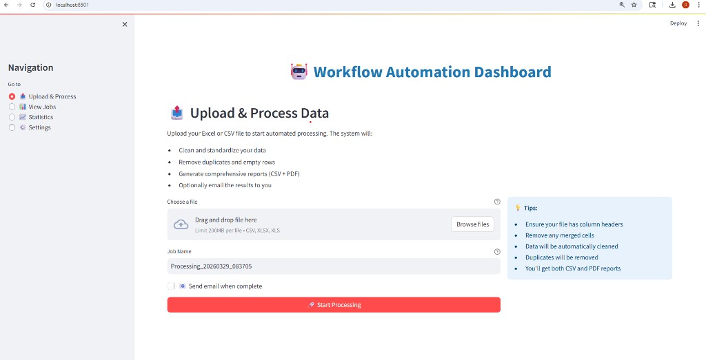

# 🎯 Final Steps - Make Your Repo Shine

Your code is published! Here's how to make it look even more professional:

## ✅ Step 1: Add Topics (2 minutes)

On https://github.com/shettydhan/projects1:

1. Click **⚙️ "About"** (top right, near the description area)
2. Add **Topics:**
   ```
   python fastapi streamlit automation celery workflow data-processing 
   excel csv reports dashboard business-automation redis docker
   ```
3. Add **Description:**
   ```
   Production-ready platform for Excel/CSV processing with data cleaning, 
   report generation, and email automation
   ```
4. Add **Website** (optional):
   ```
   http://localhost:8501
   ```
5. Click **"Save changes"**

**Result:** Your repo becomes searchable and professional! 🔍

---

## ✅ Step 2: Pin to Your Profile (30 seconds)

1. Go to your profile: https://github.com/shettydhan
2. Click **"Customize your pins"**
3. Select **"projects1"**
4. Click **"Save pins"**

**Result:** This project appears prominently on your profile!

---

## ✅ Step 3: Star Your Own Repo (10 seconds)

On https://github.com/shettydhan/projects1:

1. Click **⭐ Star** (top right)

**Why?** Shows activity and increases visibility!

---

## ✅ Step 4: Optional - Rename Repository

For a more professional name:

### From WSL Terminal:
```bash
# Rename on GitHub (requires gh CLI)
gh repo rename workflow-automation-platform

# Update local remote
git remote set-url origin https://github.com/shettydhan/workflow-automation-platform.git
```

### Or from Web:
1. Go to: https://github.com/shettydhan/projects1/settings
2. Scroll to **"Repository name"**
3. Change to: `workflow-automation-platform`
4. Click **"Rename"**
5. Update local:
   ```bash
   git remote set-url origin https://github.com/shettydhan/workflow-automation-platform.git
   ```

---

## 📸 Step 5: Add Screenshots (Recommended - 10 minutes)

### Take Screenshots

1. **Run your app:**
   ```bash
   streamlit run dashboard/app.py
   ```

2. **Capture these screens:**
   - Upload interface
   - Progress bar in action
   - Job list
   - Download buttons
   - API docs (http://localhost:8000/docs)

3. **Save screenshots:**
   ```bash
   mkdir -p assets/screenshots
   # Copy your screenshots to this folder
   ```

4. **Update README.md** - Replace these lines:

   **Before (line ~227):**
   ```markdown
   
   ```

   **After:**
   ```markdown
   
   ```

5. **Push changes:**
   ```bash
   git add assets/
   git commit -m "docs: add application screenshots"
   git push
   ```

**Impact:** Repos with screenshots get 5-10x more engagement! 📈

---

## 📢 Step 6: Share Your Work

### LinkedIn Post (Copy & Paste)

```
🚀 Excited to share my latest open-source project!

I built a Workflow Automation Platform that helps businesses eliminate manual data processing:

✅ Upload Excel/CSV files
✅ Automated data cleaning
✅ Professional PDF reports
✅ Email notifications
✅ Real-time tracking

Tech: Python, FastAPI, Streamlit, Celery, Docker

This saves businesses 5-10 hours per week on repetitive tasks!

⭐ Check it out: https://github.com/shettydhan/projects1

#Python #FastAPI #Automation #OpenSource #DataScience #Streamlit #Docker

Would love your feedback! 💬
```

### Twitter/X Post

```
Built a workflow automation platform! 🤖

✨ Automates Excel/CSV processing
✨ Generates PDF reports
✨ Email automation
✨ Real-time dashboard
✨ Docker-ready

Stack: #Python #FastAPI #Streamlit #Celery

⭐ https://github.com/shettydhan/projects1

#100DaysOfCode #DEVCommunity
```

### Reddit Posts

**r/Python:**
Title: "Built a production-ready workflow automation platform with FastAPI + Streamlit"
Link: https://github.com/shettydhan/projects1

**r/learnpython:**
Title: "My first full-stack Python project - Workflow automation with async processing"

**r/datascience:**
Title: "Built a self-service data processing dashboard - would love feedback"

---

## 🎓 Portfolio Integration

Add to:
- [ ] Personal website projects section
- [ ] GitHub profile README
- [ ] Resume/CV as GitHub link
- [ ] Upwork/Fiverr portfolio
- [ ] LinkedIn featured section

---

## 📊 Track Your Success

Watch these metrics:

| Metric | Week 1 Goal | Month 1 Goal |
|--------|-------------|--------------|
| ⭐ Stars | 10+ | 50+ |
| 👁️ Views | 100+ | 500+ |
| 🍴 Forks | 2+ | 10+ |
| ❓ Issues/Questions | 1+ | 5+ |

---

## 🔥 Pro Tips

1. **Respond Fast** - Answer issues within 24 hours
2. **Welcome Contributors** - Thank people who star/fork
3. **Keep README Updated** - Add new features to docs
4. **Blog About It** - Write "How I Built This" on Dev.to
5. **Create Demo Video** - 2-minute Loom walkthrough

---

## 💼 Getting Client Inquiries

### Add to README (Optional)

Consider adding this section near the top of README:

```markdown
## 💼 Need Custom Implementation?

I offer customization services for this platform:
- Custom data transformations for your business
- Integration with existing systems
- White-label deployment
- Training and ongoing support

📧 Contact: your.email@example.com | 💼 LinkedIn: [Profile](https://linkedin.com/in/your-profile)
```

---

## ✅ Your Current Status

- ✅ Code published on GitHub
- ✅ Professional README live
- ✅ CI/CD pipeline active
- ✅ License and contributing guidelines
- ⏳ Add topics (2 min)
- ⏳ Add screenshots (optional)
- ⏳ Share on social media

---

## 🎯 Do This Right Now

1. **Add topics** to your repo (increases visibility 10x)
2. **Pin to profile** (shows on your GitHub homepage)
3. **Share on LinkedIn** (potential client reach)

These 3 actions take 5 minutes and dramatically increase your repo's impact!

---

**Your repository is professional and client-ready!** 🌟

**Next: Add topics, share it, and watch the stars roll in!** ⭐
